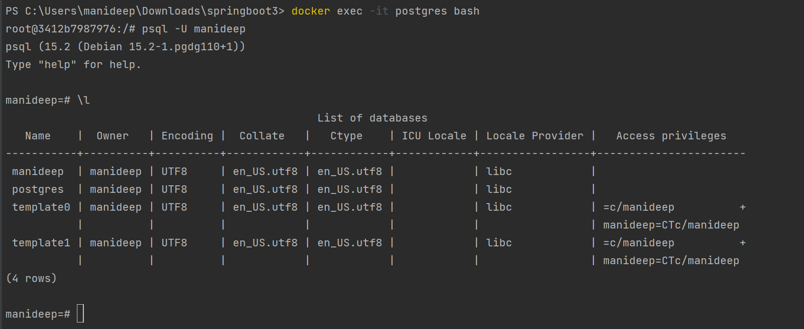

# springboot3
A springboot3 crud app with PostgreSQL using docker

https://www.youtube.com/watch?v=-mwpoE0x0JQ

We will use Postgres on Docker
application.yml:
web-application-type: servlet -> This is default and start the web server
If you set this as none, it won't start tomcat or jetty

Exclude tomcat and add jetty instead: https://docs.spring.io/spring-boot/docs/2.0.0.M4/reference/html/howto-embedded-web-servers.html

To download documentation - Right Click the project ->Maven->Download Documentation

@GetMapping("/") -> localhost:3000 give you Namasthe
@GetMapping("/greet") -> localhost:3000/greet give you Namasthe
The getter method for the instance variables(name and greet for get endpoints in our case) is the one which helps us fetch the value and publish to the get endpoint.
Instead of having a record, you create a class and remove getter method, it won't give you response in browser

Jackson is the JSON parser library for Java. It'll help us convert the Java objects to JSON.

JPA(Jakarta Persistence, earlier known as Java Persistance API) helps us store data in database from Java application without a need to write SQL queries

A Docker image is a private file system just for your container. It provides all the files and code your container needs
Start a container based on the image you built in the previous step. Running a container launches your application with private resources,
securely isolated from the rest of your machine

docker compose up -d -> to create container

docker ps -> to list containers

docker logs container-name -f -> view logs

PostgreSQL JDBC Driver -> This Driver allows Java programs to connect to a Pg database using standard, database independent Java code.
It's an opensource jdbc driver written in pure java(Type 4), which communicates using the PostgreSQL native network protocol. Because of this, the driver is platform
independent, once compiled, the driver can be used on an system.
Add the dependency below

            <dependency>
			<groupId>org.postgresql</groupId>
			<artifactId>postgresql</artifactId>
			<scope>runtime</scope>
		</dependency>
		
		<dependency>
			<groupId>org.springframework.boot</groupId>
			<artifactId>spring-boot-starter-data-jpa</artifactId>
		</dependency>

docker exec -it postgres bash -> allows us to run the shell commands within the postgres container

psql -> client to connect to postgresql db

psql -U manideep -> Connect to user manideep

\l -> will give you list of databases

CREATE DATABASE customer;

Ctrl+ D to come out of shell

\c customer -> will give you shell for customer table

\dt -> list of relations for customer

\d -> list of all relations (including the sequence)